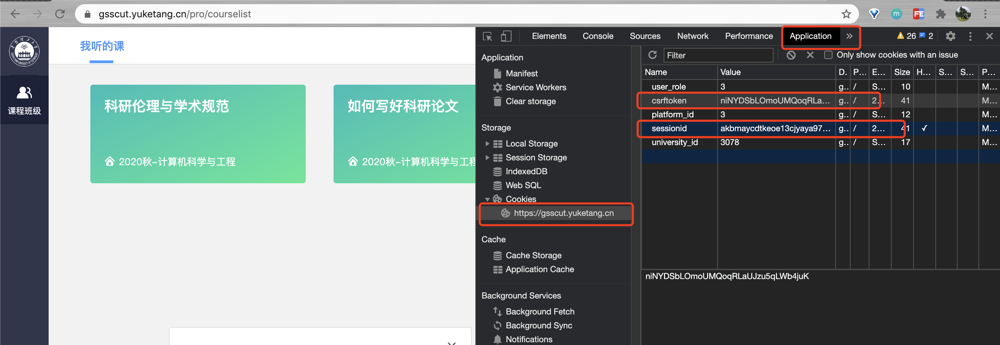

# yuketangHelper 师大版

# 声明-ll-z
## 2020-12-30
本项目根据https://github.com/heyblackC/yuketangHelper，华南理工研究生雨课堂网课脚本代码，简单修改学校网课网址和university-id/uv_id值，
使其适配师大的研究生雨课堂脚本代码。
特此感谢原项目owner!!

## 研究生雨课堂网课脚本代码
homeworkHelper.py是雨课堂网课作业刷题自动脚本  （只刷题、作业，不包括发言和推荐图的浏览，代码跑完后，最好登录在重新看一下！）
videoHelper.py是雨课堂网课视频观看自动脚本  

## 须知
- python3.x   必备包：requests
- 脚本假定使用者具有基本的计算机知识，懂得cookie，会按F12进入开发者模式，且会运行Python代码  
- 两个脚本都是将csrftoken和sessionid更改成自己登录后的cookie中对应的字段后即可运行

## 更多更新版本过程说明，请观看原项目readme，再次感谢原项目的owner们！

